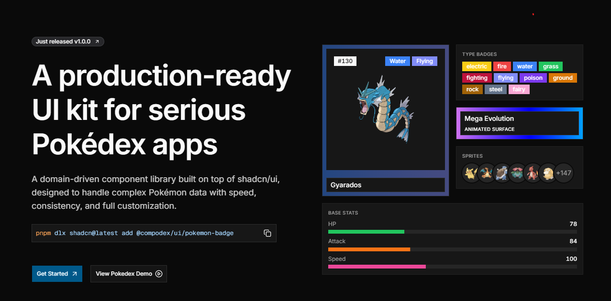

<div align="center">

<!-- IMAGE 1 — LOGO / WORDMARK
     Recomendado: un logo/wordmark "CompoDex" sobre fondo transparente (PNG/SVG).
     Tamaño sugerido: ~480px de ancho. Estilo pixel-art / retro Pokédex encaja con la marca.
     Ruta sugerida: ./public/brand/logo.png -->


# CompoDex UI

**The best way to build your own Pokédex app.**

A production-ready, domain-driven UI kit built on top of [shadcn/ui](https://ui.shadcn.com), designed to handle complex Pokémon data with speed, consistency, and full customization.

[](https://nextjs.org)
[](https://react.dev)
[](https://www.typescriptlang.org)
[](https://tailwindcss.com)
[](https://ui.shadcn.com)

[**Documentation**](https://compodex.netlify.app/docs/introduction) · [**Live Demo**](https://compodex.netlify.app/pokedex) · [**Components**](https://compodex.netlify.app/docs/components/pokemon-badge)

</div>

<!-- IMAGE 2 — HERO / SCREENSHOT PRINCIPAL
     Recomendado: captura ancha (16:9) de la landing o del demo /pokedex en acción.
     Es la imagen que más vende el proyecto: que se vean cards, badges de tipo y sprites a color.
     Tamaño sugerido: 1280x720. Ruta sugerida: ./public/brand/hero.png -->
<p align="center">
  
</p>

---

## Why CompoDex?

> **This is not a Pokédex. It is the foundation for building Pokémon applications.**

Most Pokémon projects start the same way: fetching data from PokéAPI, building cards, rendering sprites, wiring up search, and repeating the same UI patterns across every app. As projects grow, you end up rewriting the same components and maintaining inconsistent interfaces across codebases.

CompoDex solves this with a set of composable, Pokémon-aware primitives:

- 🎯 **Pokémon-First** — Components understand domain concepts: types, sprites, IDs, and base stats.
- 🧩 **Composition** — Small, reusable building blocks with a shared, predictable API.
- 📖 **Open Code** — You install the real source. Read it, customize it, own it.
- 🛠️ **Developer Experience** — TypeScript-first, consistent patterns, Tailwind-ready.
- 🚀 **Production Ready** — Built for real apps, not just demos.

---

## Installation

CompoDex is distributed as a [shadcn registry](https://ui.shadcn.com/docs/registry). Add any component to your own project with a single command — the source lands directly in your codebase.

```bash
# Add the Pokémon type color theme (recommended first)
pnpm dlx shadcn@latest add @compodex/pokemon-type-colors

# Add components
pnpm dlx shadcn@latest add @compodex/badge-type
pnpm dlx shadcn@latest add @compodex/pokemon-sprite
pnpm dlx shadcn@latest add @compodex/pokemon-card
pnpm dlx shadcn@latest add @compodex/pokemon-stat
pnpm dlx shadcn@latest add @compodex/pokedex
```

> Components that depend on the theme (badges, cards, stats) pull `@compodex/pokemon-type-colors` automatically.

### Usage

```tsx
import { PokemonBadgeType } from "@/components/compodex/ui/badge-type";
import { PokemonCard } from "@/components/compodex/ui/pokemon-card";

export function Charizard() {
  return (
    <PokemonCard type="fire" secondary="flying">
      <PokemonBadgeType type="fire">Fire</PokemonBadgeType>
      <PokemonBadgeType type="flying" variant="soft">Flying</PokemonBadgeType>
    </PokemonCard>
  );
}
```

---

## Components

| Component | Description |
| --- | --- |
| **Pokemon Type Colors** | A theme that adds `--color-type-*` tokens for all 20+ Pokémon types, generating utilities like `bg-type-fire`, `text-type-grass`, `border-type-water`. |
| **Badge Type** | A badge displaying a Pokémon type with per-type colors and `solid`, `soft`, `outline`, and `ghost` variants. |
| **Pokemon Card** | A card surface tinted by primary/secondary types, with gradient dual-type backgrounds and a `mega` variant. |
| **Pokemon Sprite** | An avatar-style sprite with image, fallback, badge, group, and group-count parts. |
| **Pokemon Stat** | Base-stat rows (HP, Attack, Defense…) on shadcn `Field` + `Progress`, with per-stat colors and composable parts. |
| **Pokedex** | Controllable Pokédex primitives: search, domain filters, incremental pagination, `renderItem` collections, empty state, and counts. Bring your own data. |

<!-- IMAGE 3 — GALERÍA DE COMPONENTES
     Recomendado: un "board" tipo grid mostrando cada componente aislado
     (un BadgeType de cada variante, una PokemonCard mono y dual-type, sprites, una fila de stats).
     Ideal generarlo como una sola imagen ancha o como mini-capturas por componente.
     Tamaño sugerido: 1280px ancho. Ruta sugerida: ./public/brand/components.png -->
<p align="center">
  
</p>

<details>
<summary><b>See dual-type card variants</b></summary>

<!-- IMAGE 4 — DETALLE DUAL-TYPE (opcional, dentro del details)
     Recomendado: captura/gif mostrando una PokemonCard cambiando de tipo primario/secundario
     y el gradiente actualizándose. Ruta sugerida: ./public/brand/card-dual-type.gif -->
<p align="center">
  
</p>

</details>

---

## The Pokédex block in action

The `Pokedex` primitive composes everything — search, type filters, pagination and your own data fetching — into a full collection experience.

<!-- IMAGE 5 — GIF DEL DEMO COMPLETO
     Recomendado: un GIF corto (8-15s) grabando /pokedex: escribir en la búsqueda,
     filtrar por tipo, hacer scroll/cargar más. El GIF es lo que más engancha en un README.
     Tamaño sugerido: 1000px ancho, peso < 10MB. Ruta sugerida: ./public/brand/pokedex-demo.gif -->
<p align="center">
  
</p>

---

## Local development

This repository is both the **component library** and its **documentation site** (Next.js 16 + Turbopack + MDX).

### Requirements

- Node.js **18.18+**
- [pnpm](https://pnpm.io)

### Setup

```bash
pnpm install   # install dependencies
pnpm dev       # start dev server at http://localhost:3000
```

### Scripts

| Script | Description |
| --- | --- |
| `pnpm dev` | Development server (Turbopack). |
| `pnpm build` | Production build. |
| `pnpm start` | Serve the production build. |
| `pnpm lint` | Lint with ESLint. |
| `pnpm typecheck` | Type-check with TypeScript. |
| `pnpm format` | Format with Prettier. |
| `pnpm registry:build` | Build the shadcn registry from `registry.json`. |

---

## Project structure

```
compo-dex/
├── app/(www)/              # Docs site + Pokédex demo routes
│   ├── docs/               # MDX-powered documentation
│   └── pokedex/            # Live Pokédex demo
├── components/
│   ├── compodex/ui/        # 📦 The published components (the registry source)
│   ├── compodex/blocks/    # Higher-level composed blocks
│   ├── demo/               # Demos rendered inside the docs
│   └── ui/                 # Base shadcn/ui primitives
├── content/docs/           # MDX documentation content
├── lib/                    # Registry, content & site configuration
├── public/r/               # Built registry JSON (served to shadcn CLI)
└── registry.json           # Registry manifest (source of truth)
```

---

## Tech stack

- **[Next.js 16](https://nextjs.org)** (App Router, Turbopack)
- **[React 19](https://react.dev)** & **[TypeScript](https://www.typescriptlang.org)**
- **[Tailwind CSS 4](https://tailwindcss.com)** with `class-variance-authority`
- **[shadcn/ui](https://ui.shadcn.com)** registry distribution
- **[Radix UI](https://www.radix-ui.com)** / **[Base UI](https://base-ui.com)** primitives
- **[Framer Motion](https://www.framer.com/motion/)** for animation
- **[MDX](https://mdxjs.com)** for documentation
- **[pokenode-ts](https://github.com/Gabb-c/pokenode-ts)** for PokéAPI typing

---

## Contributing

Contributions are welcome! To add or modify a component:

1. Create the component in `components/compodex/ui/`.
2. Register it in `registry.json`.
3. Run `pnpm registry:build` to regenerate `public/r/*.json`.
4. Add documentation under `content/docs/components/`.

Please run `pnpm lint` and `pnpm typecheck` before opening a PR.

---

## License

The CompoDex source code is released under the [MIT License](./LICENSE).

### Trademark disclaimer

"Pokémon" and all Pokémon character names are trademarks of Nintendo, Game Freak, and The Pokémon Company. CompoDex is an unofficial, fan-made project and is not affiliated with, sponsored by, or endorsed by any of them.

### Sprite and artwork attribution

Pokémon sprites and official artwork displayed in the demo are sourced from [PokéAPI](https://pokeapi.co) and the [PokeAPI/sprites](https://github.com/PokeAPI/sprites) repository. These assets are used solely for demonstration purposes and remain the property of their respective owners (Nintendo / Game Freak / The Pokémon Company).

### Built on open-source foundations

CompoDex is built on top of:

- [shadcn/ui](https://ui.shadcn.com) — MIT License
- [Radix UI](https://www.radix-ui.com) — MIT License

<div align="center">

<!-- IMAGE 6 — FOOTER / BANNER DE CIERRE (opcional)
     Recomendado: un banner delgado tipo "Built with ❤️ for trainers"
     o un sprite pequeño. Da un cierre con personalidad. Ruta: ./public/brand/footer.png -->

**[Documentation](https://compodex.netlify.app/docs/introduction) · [Demo](https://compodex.netlify.app/pokedex)**

</div>
